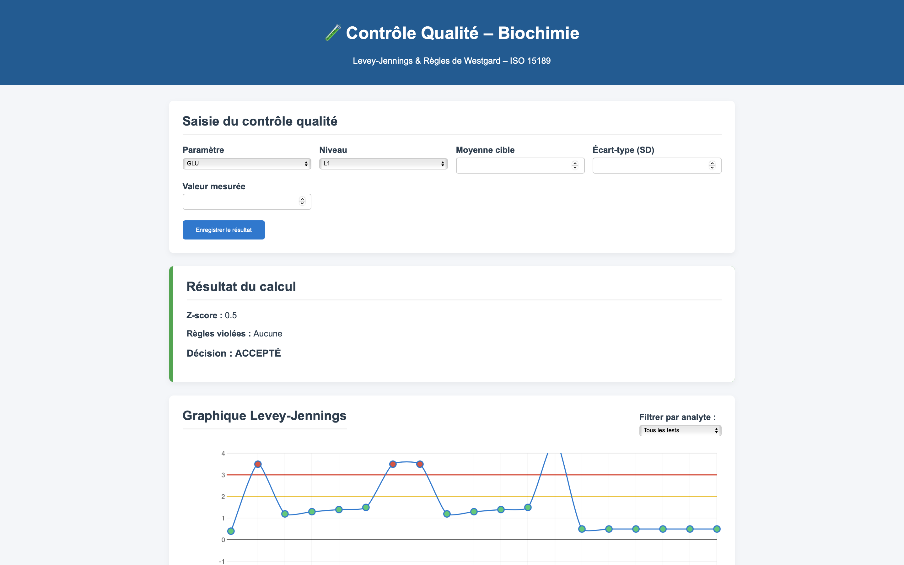

### Project Overview
**BioStat-QC** is a robust and lightweight web application designed to help medical biologists monitor the performance of their biochemistry analyzers. It automates the interpretation of **Westgard rules** and generates **Levey-Jennings charts** in real-time to ensure the reliability of medical analyses.

#### **Dynamic Visualization & Quality Control**
The core of the application is its ability to transform raw laboratory data into actionable insights. Here is a sample of the Levey-Jennings chart generated by the system:

### Key Features
- **Intelligence Decision:** Automatic analysis of Westgard rules (1-3s, 2-2s, 4-1s) to validate or reject analysis series.
- **Dynamic Visualization:** Interactive Levey-Jennings charts with filtering by analyte (Glucose, Urea, Creatinine, etc.).
- **Precision Analytics:** Automatic calculation of Z-score and Coefficient of Variation (CV%).
- **Professional Reporting:** Complete history export in PDF format for laboratory accreditation.

### Technical Stack
- **Backend:** Python / Flask
- **Database:** SQLite
- **Frontend:** HTML5, CSS3 (Modern Grid/Flexbox), JavaScript
- **Graphics:** Chart.js
- **PDF Export:** xhtml2pdf