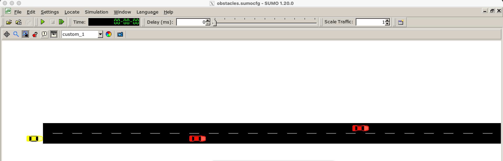

### Project Overview
The goal of this project was to train an Autonomous Vehicle (AV) to navigate a highway safely and efficiently. Using the **SUMO (Simulation of Urban Mobility)** environment, I developed RL agents capable of making lateral control decisions (Left, Right, or Stay) to avoid obstacles and maximize travel speed.

#### **The Simulation Environment**
The agent (yellow vehicle) must navigate through a two-lane stretch filled with stationary obstacles (red vehicles). 

### Technical Approach

#### **1. Q-Learning from Scratch**
- **State Discretization:** The environment was mapped into a discrete state space based on the relative position of obstacles.
- **Reward Function:** Designed to penalize collisions and lane-switching frequency while rewarding forward progress.
- **Convergence:** Implemented the Bellman equation to update Q-values, achieving a stable policy after several hundred episodes.

#### **2. Deep Reinforcement Learning (DRL)**
- **Framework:** Used **Stable Baselines3** to implement advanced algorithms like **PPO** or **DQN**.
- **Neural Network:** A Multi-Layer Perceptron (MLP) architecture was used to approximate the Q-function, allowing for more complex state representations.
- **Monitoring:** Integrated **TensorBoard** to track reward convergence and loss metrics during training.

### Key Insights
- **Exploration vs. Exploitation:** Balancing the epsilon-greedy strategy was crucial for the agent to discover that lane changes are necessary to avoid "deadlocks" behind obstacles.
- **Generalization:** The Deep RL agent showed better performance in handling randomized obstacle placements compared to the basic Q-Learning model.

### Technical Stack
- **Simulator:** SUMO (TraCI API)
- **Languages:** Python
- **AI Libraries:** Stable Baselines3, Gymnasium, NumPy
- **Visualization:** TensorBoard, Matplotlib